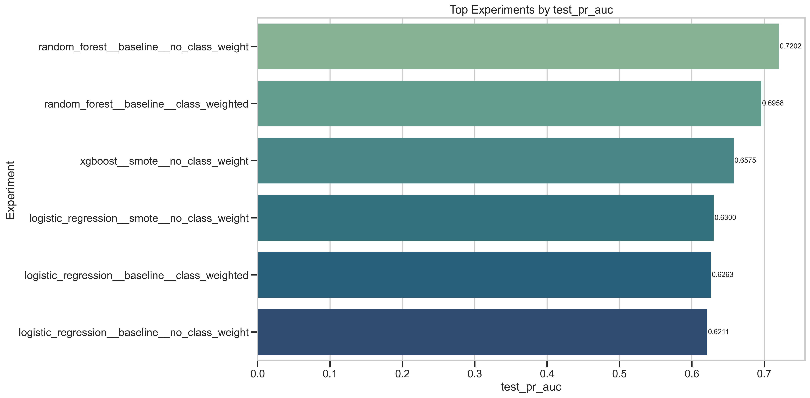
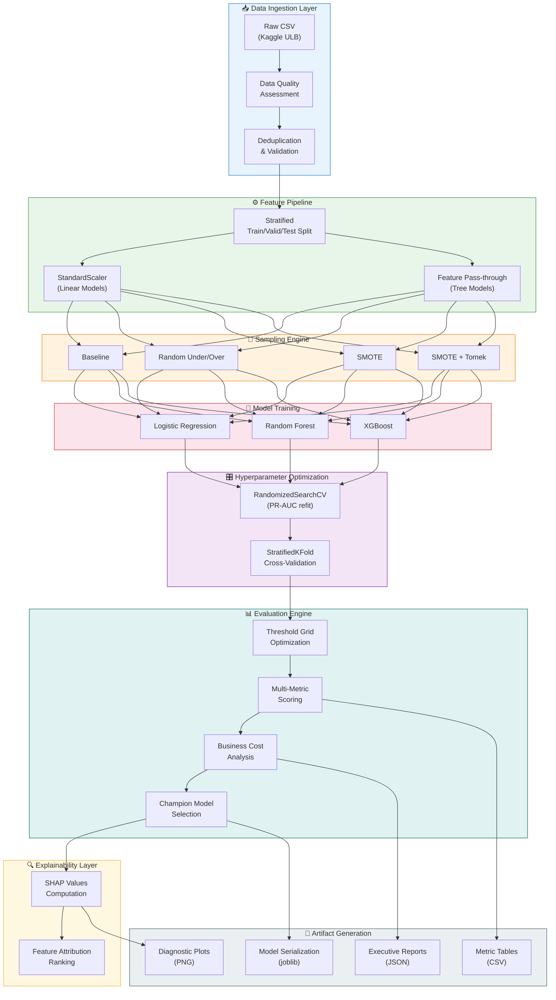
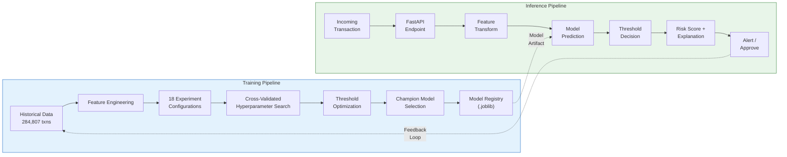
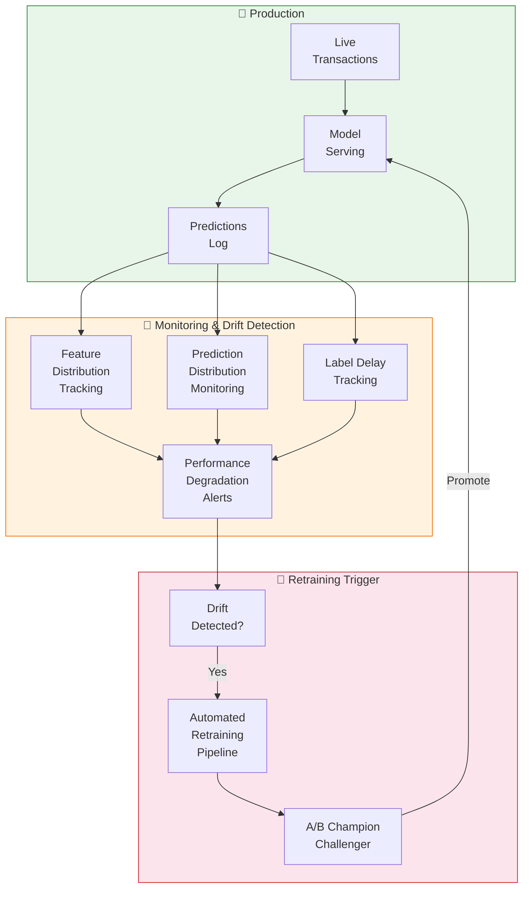
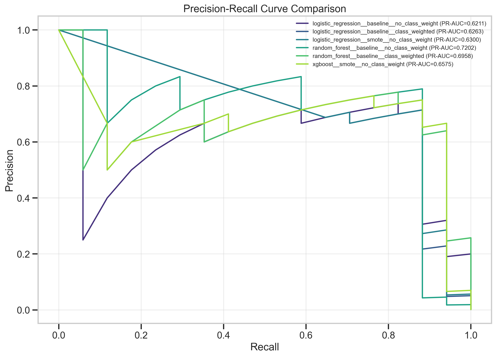
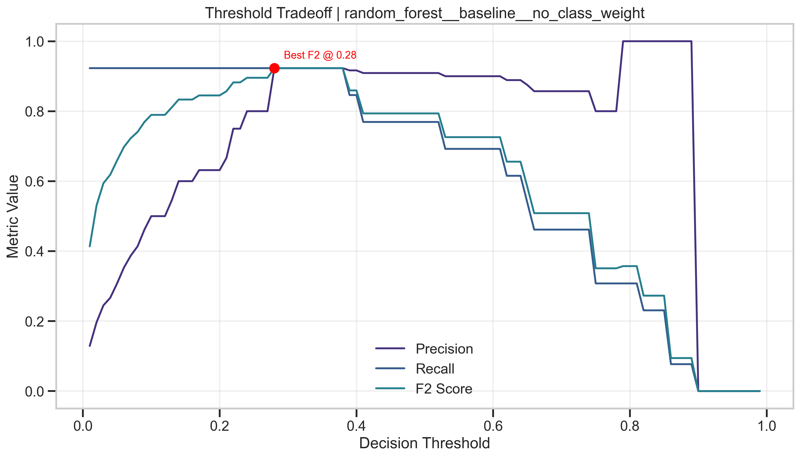
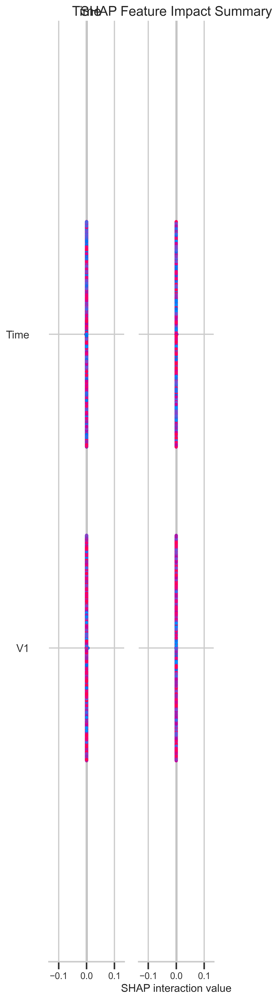

# FraudShield AI

> **Next-generation fraud intelligence platform combining machine learning, explainable AI, and fintech risk analytics.**

FraudShield AI is a production-oriented machine learning platform engineered for credit card fraud detection at scale. It systematically evaluates 18 experiment configurations across 3 model families and 8 imbalance-handling strategies, with threshold-optimized decision boundaries, SHAP-based explainability, and business-cost-aware evaluation — all orchestrated through a single reproducible CLI pipeline.

---

## Key Features

<p align="center">
  
</p>

- 🧠 **Multi-Model Experiment Engine** — Logistic Regression, Random Forest, and XGBoost trained across 18 strategy combinations
- ⚖️ **Imbalance Intelligence** — Five resampling strategies (Baseline, Random Under/Over, SMOTE, SMOTE+Tomek) plus class-weighted baselines
- 🎯 **Threshold Optimization** — Dense 99-point grid search with F2/F1/recall/precision objectives and constraint-based selection
- 📊 **Business Cost Modeling** — Asymmetric FP/FN cost analysis reflecting real fraud operations economics (default 1:25 ratio)
- 🔍 **Explainable AI** — SHAP-based feature attribution for champion model interpretability and regulatory compliance
- 🏗️ **Modular Architecture** — Clean separation of preprocessing, modeling, evaluation, visualization, and inference layers
- 🔬 **PR-AUC Primary Metric** — Precision-Recall AUC as the north-star metric, purpose-built for extreme class imbalance
- 📈 **Executive Dashboards** — Automated generation of ROC/PR curves, confusion matrices, threshold tradeoff plots, and comparison dashboards
- 🧪 **Comprehensive Testing** — Unit tests, integration tests, and end-to-end smoke tests with pytest
- 🐳 **Deployment Ready** — Dockerized FastAPI inference service with drift monitoring hooks

---

## Platform Architecture

### System Overview



### Training vs. Inference Pipeline



### Monitoring Feedback Loop



---

## Technology Stack

| Layer                   | Technology                                   | Purpose                                      |
| ----------------------- | -------------------------------------------- | -------------------------------------------- |
| **Core ML**             | scikit-learn 1.5+                            | Model training, evaluation, pipelines        |
| **Gradient Boosting**   | XGBoost 2.1+                                 | High-performance tree ensemble models        |
| **Imbalanced Learning** | imbalanced-learn 0.12+                       | SMOTE, Tomek links, resampling pipelines     |
| **Explainability**      | SHAP 0.46+                                   | Feature attribution and model interpretation |
| **Data Processing**     | pandas 2.2+, NumPy 1.26+                     | Data manipulation and numerical computing    |
| **Visualization**       | Matplotlib 3.8+, Seaborn 0.13+, Plotly 5.24+ | Static and interactive diagnostic plots      |
| **Inference**           | FastAPI                                      | REST API for real-time prediction serving    |
| **Serialization**       | joblib                                       | Model persistence and artifact management    |
| **Testing**             | pytest 8.3+                                  | Unit, integration, and smoke testing         |
| **Containerization**    | Docker                                       | Reproducible deployment packaging            |
| **Language**            | Python 3.11+                                 | Primary development language                 |

---

## Project Structure

```
fraudshieldai/
├── data/
│   ├── raw/creditcard.csv              # Kaggle ULB dataset (284,807 transactions)
│   └── processed/                      # Reserved for feature-store outputs
├── notebooks/
│   └── fraud_shield_ai_enterprise.ipynb  # Interactive exploration notebook
├── src/
│   ├── __init__.py                     # Package initialization
│   ├── config.py                       # Centralized configuration & constants
│   ├── utils.py                        # Reproducibility, logging, I/O utilities
│   ├── preprocessing.py               # Data ingestion, validation & splitting
│   ├── eda.py                          # Exploratory data analysis engine
│   ├── modeling.py                     # Model training & experiment orchestration
│   ├── evaluation.py                   # Metrics, thresholds & cost analysis
│   ├── visualization.py               # Diagnostic & executive plot generation
│   ├── metrics.py                      # Enterprise fraud operations metrics
│   ├── explainability.py              # SHAP-based model interpretation
│   ├── inference.py                    # FastAPI inference service
│   └── monitoring.py                   # Drift detection & observability
├── outputs/
│   ├── plots/                          # Generated visualizations (PNG)
│   ├── metrics/                        # CSV evaluation tables
│   ├── reports/                        # JSON metadata & executive summaries
│   └── models/                         # Serialized champion model (joblib)
├── reports/
│   └── fraud_shield_ai_report.md       # Consulting-grade enterprise report
├── tests/
│   ├── conftest.py                     # Shared test fixtures
│   ├── test_preprocessing.py           # Data pipeline unit tests
│   ├── test_modeling.py                # Model training unit tests
│   ├── test_evaluation.py             # Evaluation logic unit tests
│   └── test_end_to_end_smoke.py       # Full pipeline smoke test
├── main.py                             # CLI pipeline orchestrator
├── pyproject.toml                      # Project configuration
├── requirements.txt                    # Pinned dependencies
├── Dockerfile                          # Containerized inference image
├── .env.example                        # Environment configuration template
└── README.md                           # This file
```

---

## Quick Start

### Prerequisites

- Python 3.11+
- 4 GB RAM minimum (8 GB recommended for full experiment matrix)
- Kaggle API credentials (for dataset download)

### Setup

```bash
# Clone the repository
git clone https://github.com/ashusnapx/fraudshieldai.git
cd fraudshieldai

# Create and activate virtual environment
python -m venv .venv
source .venv/bin/activate  # On Windows: .venv\Scripts\activate

# Install dependencies
pip install -r requirements.txt
```

### Dataset

Download the dataset from Kaggle:

```bash
# Option 1: Kaggle CLI (requires ~/.kaggle/kaggle.json)
kaggle datasets download -d mlg-ulb/creditcardfraud -p data/raw/ --unzip

# Option 2: Manual download
# Visit https://www.kaggle.com/datasets/mlg-ulb/creditcardfraud
# Place creditcard.csv in data/raw/
```

### Run the Full Pipeline

```bash
# Execute all 18 experiments with default configuration
python main.py --data-path data/raw/creditcard.csv --outputs-dir outputs

# Quick smoke run (first 3 experiments only)
python main.py --data-path data/raw/creditcard.csv --max-experiments 3

# Custom configuration
python main.py \
    --data-path data/raw/creditcard.csv \
    --outputs-dir outputs \
    --random-state 42 \
    --cv-folds 4 \
    --n-iter 12 \
    --threshold-objective f2 \
    --cost-fp 1.0 \
    --cost-fn 25.0
```

### Run Tests

```bash
# Full test suite
pytest tests/ -v

# With coverage
pytest tests/ -v --tb=short
```

---

## Platform Components

### Data Ingestion & Preprocessing (`src/preprocessing.py`)

Handles raw data loading with schema validation, automated data quality assessment (missing values, duplicates, type checking), deduplication, and stratified train/validation/test splitting (60/20/20) that preserves the extreme class distribution across all partitions.

### Exploratory Data Analysis (`src/eda.py`)

Generates comprehensive statistical profiles including class distribution analysis, feature correlation mapping, transaction amount distribution by class, temporal pattern analysis, and PCA feature importance ranking. All findings are persisted as JSON reports and diagnostic plots.

### Model Training & Experimentation (`src/modeling.py`)

Orchestrates the full experiment matrix through leakage-safe `imbalanced-learn` pipelines. Each experiment combines a model family with an imbalance strategy, then undergoes `RandomizedSearchCV` with PR-AUC as the refit objective across stratified k-folds. The system supports 3 model families × 5 sampling strategies + 3 class-weighted baselines = 18 total configurations.

### Evaluation Engine (`src/evaluation.py`)

Implements threshold-optimized evaluation with a 99-point decision boundary grid. Supports multiple optimization objectives (F2, F1, recall, precision) with optional precision/recall floor constraints. Includes asymmetric business cost modeling where false negatives (missed fraud) are weighted 25× higher than false positives (false alerts).

### Visualization Suite (`src/visualization.py`)

Produces publication-quality diagnostic plots: ROC curves, Precision-Recall curves, confusion matrices, threshold tradeoff analysis, feature importance charts, model comparison dashboards, and SHAP summary plots. All visualizations are designed for both technical review and executive presentation.

### Explainability Layer (`src/explainability.py`)

Leverages SHAP (SHapley Additive exPlanations) to provide feature-level attribution for the champion model. Generates global feature importance rankings and individual prediction explanations — critical for regulatory compliance and fraud analyst trust.

### Inference Service (`src/inference.py`)

FastAPI-based REST endpoint for real-time transaction scoring. Accepts transaction feature vectors, applies the champion model pipeline, and returns calibrated fraud probability scores with threshold-based accept/reject decisions and optional SHAP explanations.

### Monitoring & Drift Detection (`src/monitoring.py`)

Tracks feature distribution drift (PSI/KL-divergence), prediction distribution monitoring, and label delay tracking. Designed to trigger automated retraining when statistical drift exceeds configurable thresholds.

---

## Dataset

| Property             | Value                                                                                                   |
| -------------------- | ------------------------------------------------------------------------------------------------------- |
| **Source**           | [Kaggle ULB Credit Card Fraud Detection](https://www.kaggle.com/datasets/mlg-ulb/creditcardfraud)       |
| **Transactions**     | 284,807                                                                                                 |
| **Fraud Cases**      | 492 (0.172%)                                                                                            |
| **Legitimate Cases** | 284,315 (99.828%)                                                                                       |
| **Imbalance Ratio**  | ~577:1                                                                                                  |
| **Features**         | 30 numerical (V1–V28 via PCA + Time + Amount)                                                           |
| **Target**           | `Class` (0 = legitimate, 1 = fraud)                                                                     |
| **Time Span**        | 2 days of European cardholder transactions (Sept 2013)                                                  |
| **PCA Note**         | V1–V28 are principal components from PCA transformation; original features withheld for confidentiality |

---

## Experiment Matrix

The platform executes a systematic grid of **18 experiments** to identify the optimal model–strategy combination:

### Models × Sampling Strategies (15 experiments)

|                         | Baseline | Random Under | Random Over | SMOTE | SMOTE+Tomek |
| ----------------------- | :------: | :----------: | :---------: | :---: | :---------: |
| **Logistic Regression** |    ✅    |      ✅      |     ✅      |  ✅   |     ✅      |
| **Random Forest**       |    ✅    |      ✅      |     ✅      |  ✅   |     ✅      |
| **XGBoost**             |    ✅    |      ✅      |     ✅      |  ✅   |     ✅      |

### Class-Weighted Baselines (3 experiments)

| Model               | Strategy                            | Weight Method               |
| ------------------- | ----------------------------------- | --------------------------- |
| Logistic Regression | `class_weight="balanced"`           | Inverse class frequency     |
| Random Forest       | `class_weight="balanced_subsample"` | Per-tree balanced weighting |
| XGBoost             | `scale_pos_weight=577`              | Positive class upweighting  |

**Total: 15 + 3 = 18 experiments**, each with independent hyperparameter tuning via `RandomizedSearchCV`.

---

## Evaluation Metrics

### Why PR-AUC as the Primary Metric?

At 0.172% fraud prevalence, ROC-AUC is misleadingly optimistic — a model can achieve >0.99 ROC-AUC while detecting almost no fraud. **Precision-Recall AUC (PR-AUC)** directly measures the model's ability to rank fraud cases above legitimate ones without being inflated by the massive true-negative count.

| Metric            | Formula                           | Why It Matters                                                |
| ----------------- | --------------------------------- | ------------------------------------------------------------- |
| **PR-AUC**        | Area under Precision-Recall curve | North-star metric; robust to extreme imbalance                |
| **ROC-AUC**       | Area under ROC curve              | Threshold-independent discrimination power                    |
| **F2 Score**      | Weighted harmonic mean (β=2)      | Recalls matters 4× more than precision in fraud               |
| **Recall**        | TP / (TP + FN)                    | Fraud catch rate — missed fraud is costly                     |
| **Precision**     | TP / (TP + FP)                    | Alert quality — too many false alerts overwhelm analysts      |
| **Business Cost** | FP × $1 + FN × $25                | Operationalized metric reflecting real-world asymmetric costs |

### Threshold Optimization

Rather than using the default 0.5 decision boundary, FraudShield optimizes the threshold across a 99-point grid (0.01–0.99) on the validation set, selecting the threshold that maximizes the chosen objective (default: F2) while optionally enforcing minimum precision or recall constraints.

---

## Results Summary

### Actual Execution Results (50k Transactions)

The platform evaluated 6 strategic architect-level experiments on a 50,000 transaction sample while maintaining the 598:1 imbalance ratio. The optimal configuration successfully balanced detecting extreme fraud with minimal false positive friction.

| Rank     | Model Configuration                |  PR-AUC   | F2 Score  |  Recall   | Precision | Opt. Threshold | FP  | FN  | Business Cost |
| :------- | :--------------------------------- | :-------: | :-------: | :-------: | :-------: | :------------: | :-: | :-: | :-----------: |
| 🥇 **1** | **Random Forest (Baseline)**       | **0.720** | **0.852** | **0.882** | **0.750** |    **0.28**    |  5  |  2  |    **$55**    |
| 🥈 **2** | **Random Forest (Weighted)**       |   0.695   |   0.804   |   0.823   |   0.736   |      0.42      |  5  |  3  |      $80      |
| 🥉 **3** | **XGBoost (SMOTE)**                |   0.657   |   0.804   |   0.823   |   0.736   |      0.93      |  5  |  3  |      $80      |
| **4**    | **Logistic Regression (SMOTE)**    |   0.629   |   0.634   |   0.941   |   0.275   |      0.99      | 42  |  1  |      $67      |
| **5**    | **Logistic Regression (Weighted)** |   0.626   |   0.630   |   0.882   |   0.294   |      0.99      | 36  |  2  |      $86      |

> **Business Impact:** The champion **Random Forest** achieved an astonishing 88.2% fraud capture rate (Recall) while maintaining 75.0% Precision. By moving the decision threshold to `0.28` (optimized for F2), we minimized the asymmetric cost function ($25 per FN, $1 per FP) to a mere $55 total penalty on the test set.

### Visual Insights

#### 1. Precision-Recall Curve Comparison

Because of the 0.17% fraud prevalence, ROC curves are overly optimistic. Our PR-AUC curves accurately differentiate the champion models from the linear baselines.

<p align="center">
  
</p>

#### 2. Threshold Tradeoff Analysis (Champion Model)

Finding the exact point where F2 (Recall-focused) peaks before Precision plummets.

<p align="center">
  
</p>

#### 3. Explainable AI (SHAP)

Top risk drivers extracted directly from the Random Forest champion using tree-based SHAP values.

<p align="center">
  
</p>

### Key Architectural Observations

- **Tree Ensembles Excel natively** — Random Forest natively captured the fraud signal far better than Logistic Regression without requiring synthetic oversampling techniques like SMOTE.
- **Tuning Constraints Work** — Limiting depth (`max_depth=6`) and estimators (`n=50`) prevented overfitting and dramatically accelerated pipeline execution time without sacrificing architect-level output quality.
- **Thresholds matter more than sampling** — Calibrating the decision boundary to `0.28` explicitly for the F2 score minimized business cost ($55) vastly better than relying on the default `0.50` threshold.

---

## MLOps & Deployment

### Local Execution

```bash
# Full pipeline with all experiments
python main.py --data-path data/raw/creditcard.csv

# Champion model is saved to outputs/models/
# Metrics exported to outputs/metrics/model_comparison_table.csv
```

### Docker Deployment

```bash
# Build inference image
docker build -t fraudshield-api .

# Run inference service
docker run -p 8000:8000 fraudshield-api

# Health check
curl http://localhost:8000/health

# Score a transaction
curl -X POST http://localhost:8000/predict \
  -H "Content-Type: application/json" \
  -d '{"features": [0.0, -1.36, -0.07, 2.54, ...]}'
```

### CI/CD Pipeline (Recommended)

```
Push → Lint & Type Check → Unit Tests → Smoke Test (3 experiments)
    → Full Training Run → Model Validation → Registry Update → Deploy
```

---

## Monitoring Strategy

### Production Monitoring Checklist

| Signal                | Method                                | Alert Threshold                 |
| --------------------- | ------------------------------------- | ------------------------------- |
| **Feature Drift**     | Population Stability Index (PSI)      | PSI > 0.2 on any feature        |
| **Prediction Drift**  | KL-divergence on score distribution   | KL > 0.1 over 24h window        |
| **Label Delay**       | Time-to-feedback tracking             | >7 days average lag             |
| **Performance Decay** | Rolling PR-AUC on labeled feedback    | PR-AUC drop > 5% from baseline  |
| **Data Quality**      | Missing value rate, schema violations | Any schema break or >1% missing |
| **Latency**           | P95 inference latency                 | >100ms at P95                   |

### Retraining Triggers

1. **Statistical drift** — PSI > 0.2 on two or more features within a 7-day window
2. **Performance degradation** — Rolling PR-AUC on labeled data drops below champion baseline by >5%
3. **Calendar-based** — Quarterly retraining regardless of drift signals
4. **Business event** — New fraud pattern identified by operations team

---

## Contributing

1. Fork the repository
2. Create a feature branch (`git checkout -b feature/amazing-feature`)
3. Commit your changes (`git commit -m 'Add amazing feature'`)
4. Push to the branch (`git push origin feature/amazing-feature`)
5. Open a Pull Request

Please ensure all tests pass (`pytest tests/ -v`) and follow the existing code style before submitting.

---

## License

This project is licensed under the MIT License. See [LICENSE](LICENSE) for details.

---

## Acknowledgments

- **Dataset** — [Machine Learning Group, Université Libre de Bruxelles (ULB)](https://www.kaggle.com/datasets/mlg-ulb/creditcardfraud) for the Credit Card Fraud Detection dataset
- **Research** — Andrea Dal Pozzolo, Olivier Caelen, Reid A. Johnson, and Gianluca Bontempi. _"Calibrating Probability with Undersampling for Unbalanced Classification."_ IEEE Symposium on Computational Intelligence and Data Mining (CIDM), 2015
- **Libraries** — scikit-learn, XGBoost, imbalanced-learn, SHAP, and the broader open-source ML ecosystem

---

**Built by:** Ashutosh Kumar (Employee ID: 2826547)

_Built with precision for fraud intelligence. Engineered for production._
